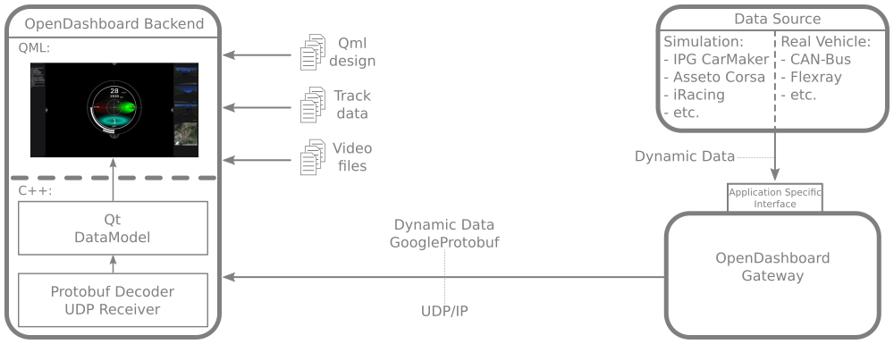

# OpenDashboard

## What is OpenDasboard

OpenDashboard provides an Open-Source  framework for rapid prototyping of car dashboard designs with [Inkscape](https://inkscape.org/de/) vector graphics and the [QtQml](https://doc.qt.io/qt-5/qtqml-index.html) framework.

A dashboard project can be be splitted up into two main components, the **frontend** that contains the actual design and the **backend** that provides the data to be visualized. OpenDashboard provides a generic backend that can be hooked up to different frontends to provide them with dynamic vehicle data (velocity, accelerations, engine signals, gps positioning data, etc.). OpenDashboard can receive data via a network socket (GoogleProtobuf messages via UDP) and therefore is able to work with prerecorded data from file or live data from a simulation or a real vehicle bus.

## Dependencies

* [Qt](https://www.qt.io/) 
* [Google Protocol Buffer (protobuf)](https://developers.google.com/protocol-buffers/) 
* [Apache XercesC](https://xerces.apache.org/xerces-c/) 
* [fmt](https://github.com/fmtlib/fmt) 
* [googletest](https://github.com/google/googletest) 
* [boost](https://www.boost.org/) 

## Installation & Development

OpenDashboard is available for the following environments:

* GNU/Linux
* Windows

For detailed information about installation and setting up of a development environment, see the following documents:

* Windows: **[doc/windows_guide.md](doc/windows_guide.md)**
* TODO Linux: doc/linux_guide.md
* TODO Linux Raspberry Pi: doc/linux_rpi_guide.md

## Usage

OpenDashboard can be used in combination with different software. Every simulation or vehicle that offers an open interface (soft- or hardware) can be hooked onto the backend by using a harddisk recorder or gateway that can transform the application specific data into generic data that can be handled by OpenDashboard.

### Prerecorded data

For rapid prototyping purposes data can be recorded to file (CSV) and replayed from disk. For this use case the project provides a harddisk player to transform the data from file into Google Protobuf messages that are transmitted via UDP/IP to the backend and visualized by the frontend.

A collection of pre-recorded dynamic data and track information can be found in this [subproject](https://github.com/OpenDashboardUI/OpenDashboardTrackData).

 

### Livedata from simulation

For usage with sim racing games, professional vehicle dynamic simulations or real vehicles the data can be read from the simulation model or physical vehicle in real time and transmitted to the backend via Google Protobus messages on UDP/IP.

## User Interface

1. The background of the window is fully usable by the frontend design
+ The backend provides the entire data model in a serialized format in this sidebar
+ For better orientation and validation of the visualized data, up to three video streams and a map view with the current position are provided on the right sidebar 

 

## Example design

Example dasboard design that was realized with OpenDashboard. The code and grapics can be found in this [subproject](https://github.com/OpenDashboardUI/OpenDashboardFrontend-ArcRaceDashboard).

